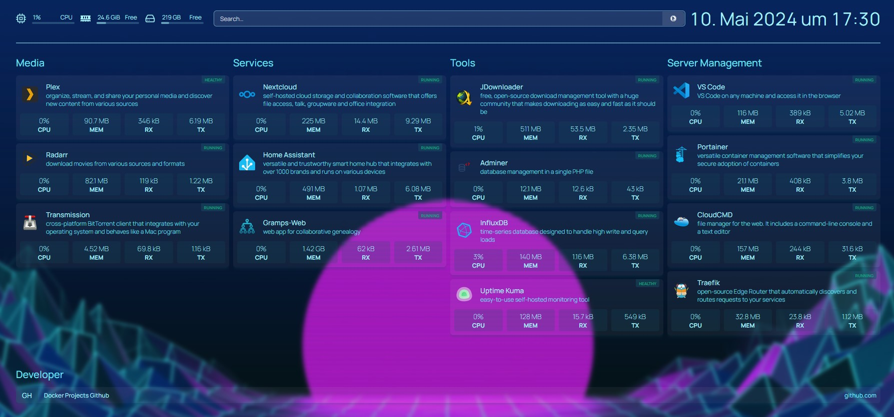

# Sammlung an simplen Docker Compose

## Services

| Service                                                               | Port                                 |
| --------------------------------------------------------------------- | ------------------------------------ |
| [Cloudcmd](https://cloudcmd.io/)                                      | [8000](http://localhost:8000)        |
| [Code Server](https://github.com/linuxserver/docker-code-server)      | [8443](http://localhost:8443)        |
| [Gramps Web](https://www.grampsweb.org/)                              | [81](http://localhost:81)            |
| [Home Assistant](https://www.home-assistant.io/)                      | [8123](http://localhost:8123)        |
| [Homepage](https://gethomepage.dev)                                   | [3045](http://localhost:3045)        |
| [JDownloader2](https://jdownloader.org/jdownloader2)                  | [5800](http://localhost:5800)        |
| [Adminer](https://www.adminer.org/)                                   | [8081](http://localhost:8081)        |
| [MariaDB](https://mariadb.org/)                                       | 3306                                 |
| [Nextcloud](https://github.com/nextcloud/docker)                      | [8080](http://localhost:8080)        |
| [Transmission](https://github.com/linuxserver/docker-transmission)    | [9091](http://localhost:9091)        |
| [Radarr](https://github.com/linuxserver/docker-radarr)                | [7878](http://localhost:7878)        |
| [Plex](https://github.com/linuxserver/docker-plex)                    | [32400](http://localhost:32400)      |
| [Portainer](https://www.portainer.io/)                                | [9000](http://localhost:9000)        |
| [InfluxDB](https://www.influxdata.com/)                               | [8086](http://localhost:8086)        |
| [Telegraf](https://www.influxdata.com/time-series-platform/telegraf/) |                                      |
| [traefik](https://doc.traefik.io/traefik/)                            | [8082](http://localhost:8082) 80 443 |
| [Uptime Kuma](https://github.com/louislam/uptime-kuma)                | [3001](http://localhost:3001)        |
| [Watchtower](https://containrrr.dev/watchtower/)                      |                                      |

## ToDo

- https://github.com/ChristianLempa/boilerplates/tree/main/docker-compose

- guacamole
  - readme
  - homepage
  - 

- webtrees
  - homepage
  - readme

- Graphana Loki
  - readme
  - homepage
- Authentik
- alpine
- nginx
- obsidian livesync
- whoami
- adguard home
- dozzle
- dockge
- glances
- kavita
- mealie
- metube
- pinchflat
- netalertx
- netdata
  - demo: https://app.netdata.cloud/spaces/netdata-demo/rooms/all-nodes
- stirlingpdf
- mariadb-docker:
  - phpmyadmin
  - https://github.com/sqlchat/sqlchat
  - https://github.com/beekeeper-studio/beekeeper-studio
  - https://dbgate.org/
