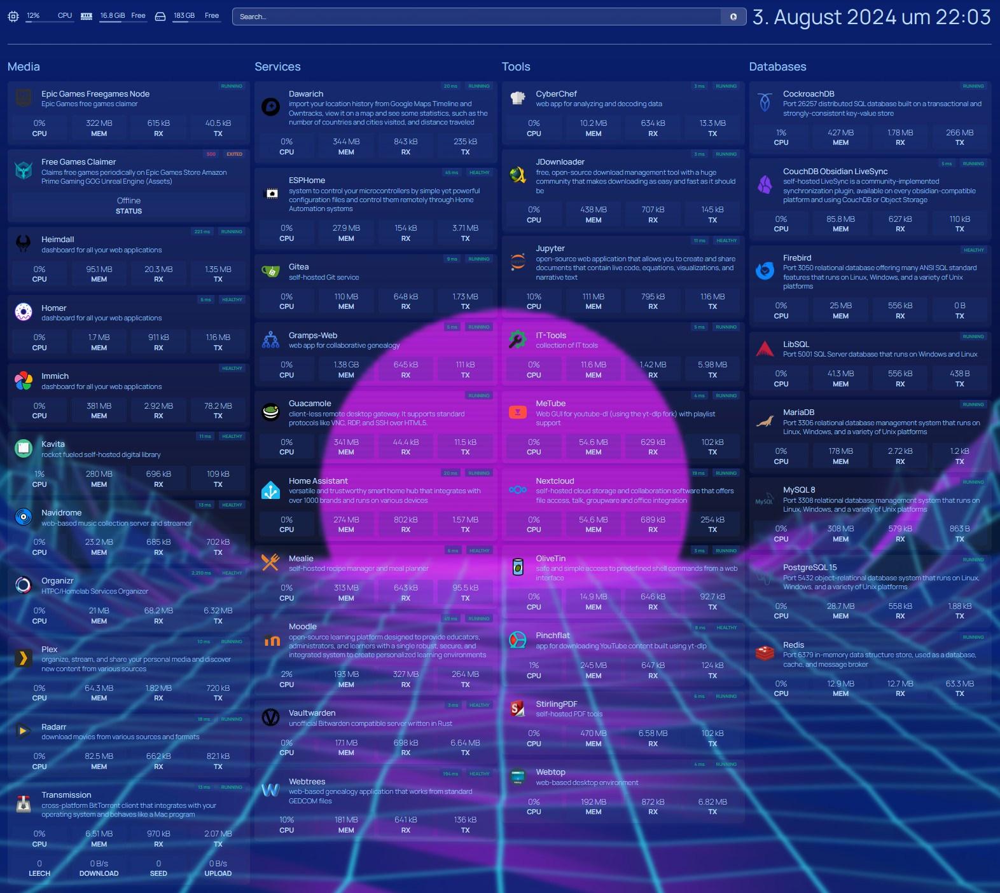
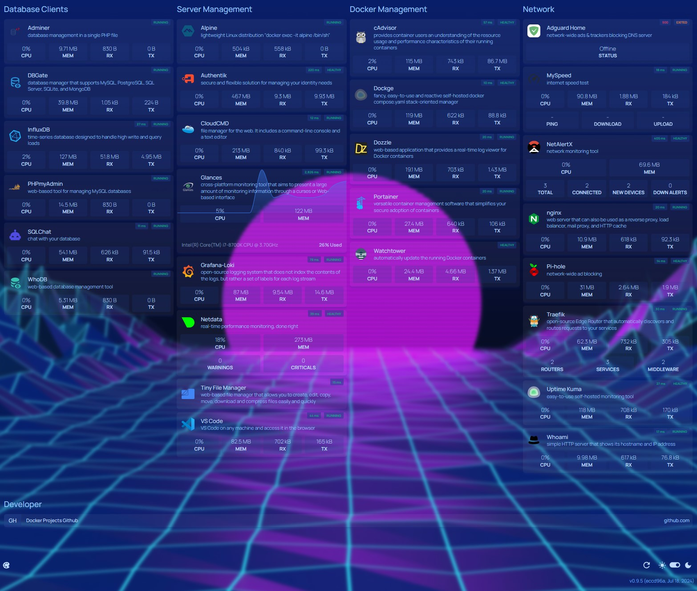

# Sammlung an simplen Docker Compose

## Usage

Run first:
```bash
docker network create --driver bridge proxy
```

### For container using host networking:
The host networking driver only works on Linux hosts, but is availabe as a beta feature on Docker Desktop version 4.29 and later for Mac, Windows, and Linux. To enable this feature, navigate to the Features in development tab in Settings, and then select Enable host networking.

## Services

| Service                                                                        | Port                                                                 |
| ------------------------------------------------------------------------------ | -------------------------------------------------------------------- |
| [Adguard Home](https://hub.docker.com/r/adguard/adguardhome)                   | [3002](http://localhost:3002) 53 67 68                               |
| [Adminer](https://www.adminer.org/)                                            | [8081](http://localhost:8081)                                        |
| [Alpine](https://hub.docker.com/_/alpine)                                      | docker exec -it alpine /bin/sh                                       |
| [Authentik](https://goauthentik.io/)                                           | [9001](http://localhost:9001)                                        |
| [cAdvisor](https://github.com/google/cadvisor)                                 | [8096](http://localhost:8096)                                        |
| [Cloudcmd](https://cloudcmd.io/)                                               | [8000](http://localhost:8000)                                        |
| [CockroachDB](https://www.cockroachlabs.com/)                                  | 26257                                                                |
| [Code Server](https://github.com/linuxserver/docker-code-server)               | [8443](http://localhost:8443)                                        |
| [CyberChef](https://github.com/gchq/CyberChef)                                 | [8094](http://localhost:8094)                                        |
| [Dawarich](https://github.com/Freika/dawarich)                                 | [3007](http://localhost:3007)                                        |
| [DBGate](https://dbgate.org/)                                                  | [8084](http://localhost:8084)                                        |
| [Dockge](https://github.com/louislam/dockge)                                   | [5002](http://localhost:5002)                                        |
| [Dozzle](https://dozzle.dev/)                                                  | [8087](http://localhost:8087)                                        |
| [epicgames-freegames-node](https://github.com/claabs/epicgames-freegames-node) | [3003](http://localhost:3003)                                        |
| [ESPHome](https://esphome.io/) | [6052](http://localhost:6052) |
| [Firebird](https://firebirdsql.org/)                                           | 3050                                                                 |
| [free-games-claimer](https://github.com/vogler/free-games-claimer)             | [6080](http://localhost:6080)                                        |
| [Gitea](https://about.gitea.com/)                                              | [3004](http://localhost:3004) 222                                    |
| [Glances](https://nicolargo.github.io/glances/)                                | [61208](http://localhost:61208)                                      |
| [Grafana-Loki](https://grafana.com/docs/loki/latest/)                          | [3000](http://localhost:3000) 3100                                   |
| [Gramps Web](https://www.grampsweb.org/)                                       | [81](http://localhost:81)                                            |
| [Guacamole](https://github.com/jwetzell/docker-guacamole)                      | [80](http://localhost)                                               |
| [Heimdall](https://heimdall.site/)                                             | [8097](http://localhost:8097)                                        |
| [Home Assistant](https://www.home-assistant.io/)                               | [8123](http://localhost:8123)                                        |
| [Homepage](https://gethomepage.dev)                                            | [3045](http://localhost:3045)                                        |
| [Homer](https://github.com/bastienwirtz/homer)                                 | [8099](http://localhost:8099)                                        |
| [Immich](https://immich.app/) | [2283](http://localhost:2283)  |
| [InfluxDB](https://www.influxdata.com/)                                        | [8086](http://localhost:8086)                                        |
| [IT-Tools](https://it-tools.tech/)                                             | [8095](http://localhost:8095)                                        |
| [JDownloader2](https://jdownloader.org/jdownloader2)                           | [5800](http://localhost:5800)                                        |
| [Jupyter](https://jupyter.org/)                                                | [8888](http://localhost:8888)                                        |
| [Kavita](https://www.kavitareader.com/)                                        | [5003](http://localhost:5003)                                        |
| [libsql](https://github.com/tursodatabase/libsql)                              | 5001 8098                                                            |
| [MariaDB](https://mariadb.org/)                                                | 3306                                                                 |
| [Mealie](https://mealie.io/)                                                   | [9925](http://localhost:9925)                                        |
| [MeTube](https://github.com/alexta69/metube)                                   | [8088](http://localhost:8088)                                        |
| [moodle](https://hub.docker.com/r/bitnami/moodle)                              | [8089](http://localhost:8089)                                        |
| [MySpeed](https://github.com/gnmyt/myspeed)                                    | [5216](http://localhost:5216)                                        |
| [MySQL 8](https://www.mysql.com/)                                              | 3308                                                                 |
| [Navidrome](https://www.navidrome.org/)                                        | [4533](http://localhost:4533)                                        |
| [NetAlertX](https://github.com/jokob-sk/NetAlertX)                             | [20211](http://localhost:20211)                                      |
| [NetData](https://www.netdata.cloud/)                                          | [19999](http://localhost:19999)                                      |
| [Nextcloud](https://github.com/nextcloud/docker)                               | [8080](http://localhost:8080)                                        |
| [nginx](https://hub.docker.com/_/nginx)                                        | [82](http://localhost:82)                                            |
| [Obsidian-LiveSync](https://github.com/vrtmrz/obsidian-livesync)               | [5984](http://localhost:5984/_utils/)                                |
| [Olivetin](https://github.com/OliveTin/OliveTin)                               | [1337](http://localhost:1337)                                        |
| [PHPmyAdmin](https://hub.docker.com/_/phpmyadmin)                              | [8083](http://localhost:8083)                                        |
| [PiHole](https://pi-hole.net/)                                                 | [9002](http://localhost:9002)                                        |
| [Pinchflat](https://github.com/kieraneglin/pinchflat)                          | [8945](http://localhost:8945)                                        |
| [Plex](https://github.com/linuxserver/docker-plex)                             | [32400](http://localhost:32400)                                      |
| [Portainer](https://www.portainer.io/)                                         | [9000](http://localhost:9000)                                        |
| [PostgreSQL 15](https://www.postgresql.org/)                                   | [5432](http://localhost:5432)                                        |
| [Radarr](https://github.com/linuxserver/docker-radarr)                         | [7878](http://localhost:7878)                                        |
| [Redis](https://redis.io/)                                                     | [6379](http://localhost:6379)                                        |
| [SQLChat](https://github.com/sqlchat/sqlchat)                                  | [3005](http://localhost:3005)                                        |
| [StirlingPDF](https://stirlingtools.com/)                                      | [8092](http://localhost:8092)                                        |
| [Telegraf](https://www.influxdata.com/time-series-platform/telegraf/)          |                                                                      |
| [TinyFileManager](https://tinyfilemanager.github.io/)                          | [8091](http://localhost:8091)                                        |
| [traefik](https://doc.traefik.io/traefik/)                                     | [8085](http://localhost:8085) 83 444                                 |
| [Transmission](https://github.com/linuxserver/docker-transmission)             | [9091](http://localhost:9091)                                        |
| [Uptime Kuma](https://github.com/louislam/uptime-kuma)                         | [3001](http://localhost:3001)                                        |
| [Vaultwarden](https://github.com/dani-garcia/vaultwarden)                      | [8093](http://localhost:8093)                                        |
| [Watchtower](https://containrrr.dev/watchtower/)                               |                                                                      |
| [Webtop](https://github.com/linuxserver/docker-webtop)                         | [3008](http://localhost:3008) [3009](https://localhost:3009) (HTTPS) |
| [Webtrees](https://github.com/fisharebest/webtrees)                            | [86](http://localhost:86)                                            |
| [Whoami](https://hub.docker.com/r/traefik/whoami)                              | [84](http://localhost:84)                                            |
| [whoDB](https://github.com/clidey/whodb)                                       | [8082](http://localhost:8082)                                        |





## ToDo

### Add to Homepage

- esphome
- organizr

## Tools

- [Composerize](https://www.composerize.com/)
- [Kasmweb](https://www.kasmweb.com/)
- [ChristianLempa/boilerplates](https://github.com/ChristianLempa/boilerplates/tree/main/docker-compose)
